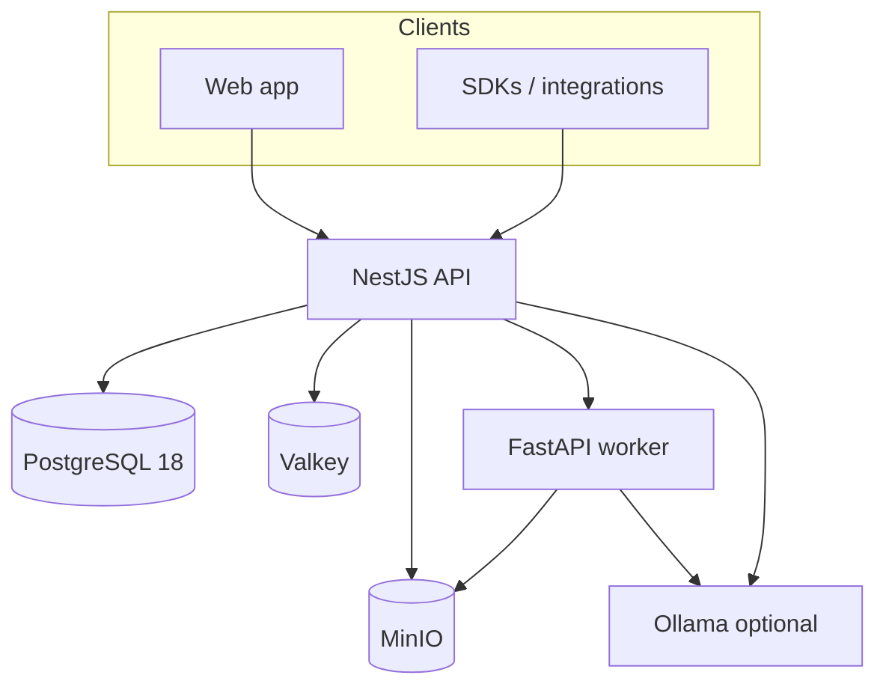

<p align="center">
  <picture>
    <source media="(prefers-color-scheme: dark)" srcset="docs/assets/logo/logo-dark.svg">
    <source media="(prefers-color-scheme: light)" srcset="docs/assets/logo/logo-light.svg">
    
  </picture>
</p>

<p align="center">
  <strong>Self-hosted document intelligence: OCR, auto-labeling, search and chat over your documents, on your own hardware.</strong>
</p>

<p align="center">
  <a href="https://docuvate.de">Website</a>
  ·
  <a href="docs/">Documentation</a>
  ·
  <a href="#quickstart">Quickstart</a>
  ·
  <a href="openapi/docuvate.v1.json">API</a>
  ·
  <a href="CONTRIBUTING.md">Contributing</a>
</p>

<p align="center">
  
  
  
  
  
  
</p>

## Why Docuvate

Paperless tools often stop at full-text search. Docuvate targets **structured extraction** (fields and layout blocks you can edit), **label-first organization**, and a **product-grade UI**, while staying **self-hostable** and **CPU-friendly** for typical deployments.

## Features

| Area            | Highlights                                                           |
| --------------- | -------------------------------------------------------------------- |
| Library         | Filter, bulk actions, duplicate stacks, inbox flow                   |
| Document detail | Preview, OCR text, layout blocks, editable fields, labels            |
| Labels          | Vocabulary, suggestions from embeddings, inbox triage                |
| Connectors      | Plugin catalog (mail, DMS, HA, S3) with connect and import flows     |
| Filesystem      | Nested folders and explorer alongside labels                         |
| Chat            | Per-document chat when a provider (for example Ollama) is configured |
| Integrations    | API-first: use Docuvate headless behind your own apps (OpenAPI, ABAC) |
| Auth            | Email and password via better-auth, password reset (Mailpit locally) |

## Quickstart

From the repository root:

```bash
cp .env.example .env   # optional for Compose defaults; useful for local overrides
docker compose up -d --build
```

Wait until **web**, **api**, and **worker** are healthy (PostgreSQL 18 and Valkey healthchecks pass first).

| Service              | URL                                   |
| -------------------- | ------------------------------------- |
| Web app              | http://localhost:5173                 |
| API health           | http://localhost:3001/health          |
| API ready            | http://localhost:3001/health/ready    |
| OpenAPI              | http://localhost:3001/v1/openapi.json |
| Mailpit (local mail) | http://localhost:8025                 |

**First login:** open the web URL, register, open **Library**, upload PDFs or images, then open a document for preview and fields.

Host port overrides (see `docker-compose.yml`): PostgreSQL 18 on host port **5433**, MinIO **9010** / console **9011**, Ollama **127.0.0.1:11434**.

Document chat uses Ollama (default model `qwen2.5:3b`). Increase `OLLAMA_MEM_LIMIT` in `.env` for larger models (see `.env.example`).

### PostgreSQL 18

Docker Compose runs **PostgreSQL 18.6** (`postgres:18.6-alpine`). Fresh installs use the `pgdata` Docker volume.

**Back up your database and MinIO `documents` bucket before upgrading production data.** Never use `docker compose down -v` to reset a stack: that **deletes all documents and the database**. See [Self-hosting](docs/self-hosting.md) for volumes and recovery.

Local development without Docker also expects **PostgreSQL 18.6** (or compatible 18.x), plus MinIO, Valkey, and Node 22+ / uv for the worker.

## Architecture



Clean architecture in API and worker: domain, application, infrastructure, presentation. Details in [docs/architecture.md](docs/architecture.md).

## API-first

Use Docuvate headless behind your own apps and automations.

- OpenAPI: [openapi/docuvate.v1.json](openapi/docuvate.v1.json) (also served from the running API)
- Authorization: ABAC model (see [docs/adr/008-headless-v1-abac.md](docs/adr/008-headless-v1-abac.md))
- SDKs: [docs/sdks.md](docs/sdks.md)

## Editions

| Edition       | License  |
| ------------- | -------- |
| **Community** | AGPL-3.0 |

Commercial editions are offered separately; see [docuvate.de](https://docuvate.de). Community source in this repository remains AGPL-3.0.

## Documentation

- [Self-hosting (Compose)](docs/self-hosting.md)
- [Architecture](docs/architecture.md)
- [Document processing pipeline](docs/document-processing-pipeline.md)
- [Connectors](docs/connectors.md)
- [Design tokens](docs/design-tokens.md)
- [Threat model (notes)](docs/threat-model.md)
- [ADRs](docs/adr/)

## Roadmap (planned)

These items are **not** promised timelines; they track known gaps and stubs on `main`:

- Login rate limiting (Valkey)
- Production observability defaults (OpenTelemetry collectors)
- Deeper Paperless migration adapter
- Expanded connector coverage and automation

## Contributing

See [CONTRIBUTING.md](CONTRIBUTING.md), [CODE_OF_CONDUCT.md](CODE_OF_CONDUCT.md), and [SECURITY.md](SECURITY.md). Before opening a pull request, run the same jobs as [.github/workflows/ci.yml](.github/workflows/ci.yml) locally (see [docs/local-ci.md](docs/local-ci.md)).

## Security

Report vulnerabilities privately: [SECURITY.md](SECURITY.md).

## License

AGPL-3.0. See [LICENSE](LICENSE).
