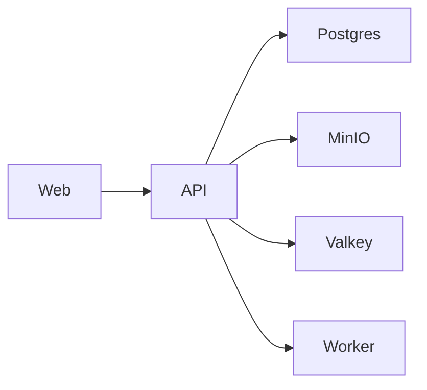

# Architecture

Docuvate follows **Clean Architecture** in the API and worker:

- **Domain:** entities, ports, domain errors (no framework imports).
- **Application:** use cases orchestrating ports.
- **Infrastructure:** Postgres, MinIO, Valkey queue, HTTP worker client, better-auth.
- **Presentation:** Nest controllers, React routes.

## Runtime topology

Compose ships without a collector (OTEL off). Production can export to SigNoz/Sentry via `packages/otel`.

## Ports (MVP)

| Port | Implementation |
|------|----------------|
| DocumentRepository | Postgres |
| ObjectStorage | MinIO |
| ExtractionPort | HTTP → worker |
| SearchPort | Postgres FTS + ILIKE |
| Session auth | better-auth adapter |
| IdentityProviderPort | stub (extension point for external identity providers) |
| PaperlessImportPort | stub |
| DocumentChatPort | Router + providers: context (worker), donut-ml, ollama, mock (`DOCUMENT_CHAT_PROVIDER`, Settings) |
| FolderRepository | Postgres nested folders |
| DuplicateRepository | Postgres candidates (hash + embedding) |
| DuplicateStackRepository | Persisted primary/version stacks for list collapse |
| EmbeddingPort | HTTP → worker `/embed` (e5-small) |

See `docs/ai-models.md` for model mapping.
