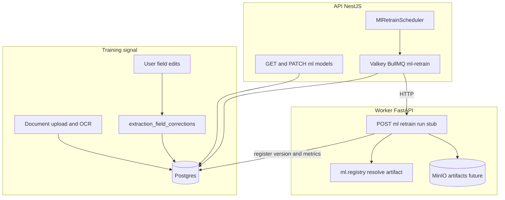

# MLOps: background retrain, registry, canary, rollback

Product goal: refine OCR, DocQA, and field models in the background as documents, OCR text, and user field corrections accumulate — with versioned data and models, safe promotion, and rollback.

This document is the **recommended stack** and **first implementation slice**. Code under `apps/api/src/modules/model-registry/` and `apps/worker/.../infrastructure/ml/` is **scaffolding** unless marked production-ready below.

## Goals and non-goals

| In scope (slice 1) | Out of scope (later) |
| --- | --- |
| Versioned **metadata** for models and training snapshots in Postgres | Full GPU training pipelines |
| Training signal from `extraction_field_corrections` | Fine-tuning Paddle/Donut on tenant GPUs |
| Retrain job queue + worker **stub** that registers a new version | Automated OCR CER/WER on held-out scans at scale |
| Canary gate on **stored metrics** (manual or stub-eval) | Per-tenant model isolation |
| API: list versions, promote, rollback, trigger retrain | MLflow server in default compose |

**Constraint:** default inference paths stay env-driven (`EXTRACTOR_ENGINE`, fastembed model name, `DOCUMENT_CHAT_PROVIDER`). Registry overrides apply only when `MLOPS_REGISTRY_ENABLED=true` on the worker (future hook; stub reads config only today).

## Architecture

### Clean Architecture mapping

| Layer | Responsibility |
| --- | --- |
| **Domain** (`model-registry/domain`) | Model family kinds, lifecycle states, canary policy types |
| **Application** | List/promote/rollback, enqueue retrain, threshold/cron triggers (corrections live in extraction-feedback) |
| **Infrastructure** | Postgres repositories, HTTP worker client, BullMQ |
| **Presentation** | `/v1/ml/*` controllers |

Worker mirrors the same split: `domain` ports (future), `application/retrain.py`, `infrastructure/ml/*`.

## Recommended stack: MLflow vs alternatives

| Option | Fit for Docuvate | Verdict |
| --- | --- | --- |
| **MLflow Tracking + Model Registry** | Self-hostable, OSS, Python-first, stores metrics/params/artifacts URIs; no lock-in to a cloud vendor | **Default recommendation** for tracking runs and artifact URIs |
| **Postgres registry (what we ship in slice 1)** | Source of truth for **which version is active/canary** in the product; works without MLflow uptime | **Ship now** — `ml_model_versions`, `ml_training_data_snapshots`, `ml_retrain_jobs` |
| **Hugging Face Hub (private)** | Good for Donut/transformer weights; awkward for PaddleOCR zip bundles | **Secondary** artifact store for `docqa` / Donut track |
| **Weights & Biases / Comet** | Excellent UX, SaaS | Optional for teams already on W&B; not required for MVP |
| **DVC + MinIO** | Dataset versioning at file level | **Complement** for large OCR image dumps (`storage_uri` on snapshots) |

**Concrete recommendation:** run **MLflow Tracking** (SQLite or Postgres backend + MinIO artifact root) beside compose in a later PR; until then, API/worker write **`external_run_id`** (nullable) and **`artifact_uri`** on `ml_model_versions` so MLflow can become authoritative for experiments without changing product tables.

Environment knobs (API + worker):

| Variable | Default | Meaning |
| --- | --- | --- |
| `MLOPS_ENABLED` | `false` | Master switch for retrain scheduler + queue worker |
| `MLOPS_REGISTRY_ENABLED` | `false` | Worker resolves weights from registry (stub) |
| `MLFLOW_TRACKING_URI` | empty | When set, retrain stub logs intent only (no client yet) |
| `MLOPS_RETRAIN_CORRECTION_THRESHOLD` | `100` | New corrections since last snapshot → enqueue retrain |
| `MLOPS_RETRAIN_CRON_INTERVAL_MS` | `21600000` (6h) | Periodic threshold scan |
| `MLOPS_CANARY_MAX_METRIC_DROP` | `0.05` | Max relative drop vs baseline for promotion |
| `MLOPS_CANARY_REQUIRED_METRIC` | `field_f1` | Metric key in `metrics` JSON |

## Data lineage

1. **Corrections** — `RecordExtractionFieldCorrectionsUseCase` (extraction-feedback) writes `extraction_field_corrections` on document field saves (`old_value`, `new_value`, `field_tag_id`, source `user_correction`; the document labels at that time in `extraction_field_correction_labels`). List/export via `GET /v1/extraction-feedback/field-corrections`.
2. **Snapshot** — Retrain job creates `ml_training_data_snapshots` with `dataset_version` (e.g. `2026-04-07T12:00:00Z`), `row_count`, optional `storage_uri` (exported JSONL in MinIO), `source_watermark` = max(correction.created_at) included.
3. **Model version** — Worker stub registers `ml_model_versions` with `version_tag`, `metrics`, `training_snapshot_id`, `lifecycle=registered`.
4. **Canary** — Promotion to `canary` runs evaluation rows in `ml_canary_evaluations` (baseline = current `active`). If any required metric drops more than `MLOPS_CANARY_MAX_METRIC_DROP`, lifecycle → `failed` and job marked failed (**auto-abort**).
5. **Active** — Successful canary: `active` on candidate, previous active → `archived` (rollback = promote an archived version back to `active`).

Model families (seeded in migration):

| `id` | `kind` | Current production default |
| --- | --- | --- |
| `paddle-ocr` | `ocr` | PaddleOCR PP-OCRv4 mobile |
| `fastembed-minilm` | `embedding` | `paraphrase-multilingual-MiniLM-L12-v2` |
| `context-docqa` | `docqa` | Worker context QA / embeddings |
| `heuristic-fields` | `field_extractor` | Regex heuristics + label custom fields |

## Retrain triggers

1. **Manual** — `POST /v1/ml/retrain` with `{ "familyId": "heuristic-fields" }` (authenticated user; production should restrict to admin — not enforced in slice 1).
2. **Threshold** — Scheduler counts corrections with `created_at > last_snapshot.source_watermark` for field-related families; if count ≥ threshold, enqueue job with `trigger_kind=threshold`.
3. **Cron** — Same scheduler on `MLOPS_RETRAIN_CRON_INTERVAL_MS` re-runs threshold logic (batch-full retrain is “export all corrections since watermark” in the stub).

Queue: Valkey queue `ml-retrain` (BullMQ), same pattern as `document-extraction`.

## Canary and rollback

**Promotion path** (`PATCH /v1/ml/models/versions/:id/lifecycle`):

- `registered` → `canary`: evaluate metrics vs current `active` for that family.
- `canary` → `active`: only if latest canary evaluation `passed=true`; demote old active to `archived`.
- **Rollback:** set a known-good `archived` version to `active` (skips canary re-check in slice 1 — document as operator escape hatch; tighten with “rollback requires admin + audit” later).

Stub metrics: retrain job writes synthetic improving `field_f1` so canary passes in dev. Production replaces this with offline eval on a golden set.

## Worker integration (inference)

Today: unchanged. Future:

- `paddle_engine._get_paddle_ocr()` consults `ml.registry.active_artifact("paddle-ocr")` when `MLOPS_REGISTRY_ENABLED=true`.
- `fastembed_model.MODEL_NAME` overridden from registry for `fastembed-minilm`.

Slice 1 only adds `resolve_model_config()` returning env defaults + optional DB URI placeholder.

## Operational notes

- **CPU-first:** OCR/embedding retrain in product history is CPU; Donut/MPS is a **separate track** (`docqa` family).
- **Observability:** link `ml_retrain_jobs.id` to OTel trace id in a follow-up.
- **Multi-tenant:** corrections are per `user_id`; snapshot export should filter by deployment mode (single-tenant vs pooled) before real training.

## Implementation status (honest)

| Component | Status |
| --- | --- |
| Design doc | This file |
| Postgres tables + seed families | dbmate migrations under `db/migrations/` |
| Field correction capture on document patch | **`extraction-feedback` module** — not duplicated here |
| Registry CRUD + promote/rollback API | Implemented |
| Retrain queue + scheduler | Implemented (gated by `MLOPS_ENABLED`) |
| Worker `/v1/ml/retrain/run` | **Stub** — registers version, no training |
| MLflow client | **Not implemented** — URI env only |
| Inference override from registry | **Not implemented** — flags documented |

## First production milestones after stub

1. Export corrections + OCR text to MinIO JSONL; point `storage_uri` at object.
2. Deploy MLflow + wire run ids into `external_run_id`.
3. Real eval harness for `field_f1` / OCR CER on held-out set.
4. Admin guard on promote/retrain endpoints.
5. Wire Paddle/fastembed to registry when `MLOPS_REGISTRY_ENABLED=true`.
