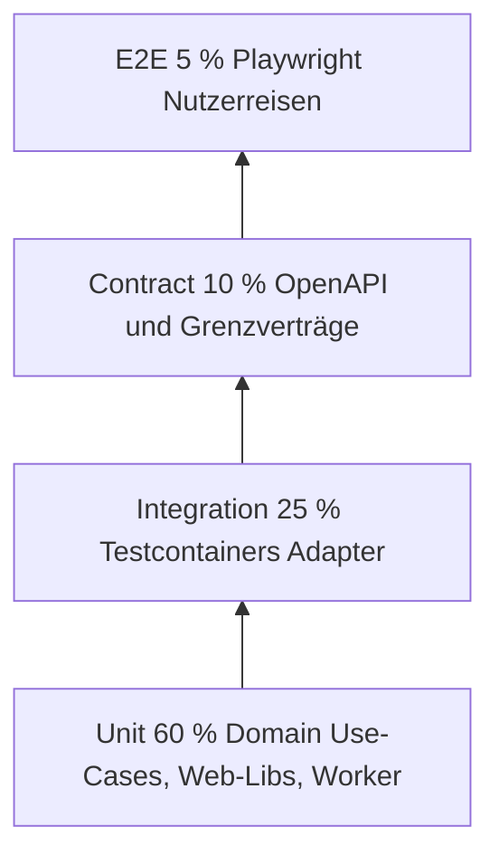

# Testkonzept Docuvate

Stand: 2026-10-08. Verantwortlich: Engineering (Clean Architecture). Ziel: nachhaltige Qualität durch eine Testpyramide mit messbaren Gates, ohne Doctor-Scores (nestjs-doctor, react-doctor, fastapi-doctor) zu verschlechtern.

## 1. Ist-Analyse (Repo, gemessen)

### 1.1 Test-Frameworks

| Bereich | Framework | Runner | Anmerkung |
|---------|-----------|--------|-----------|
| API (`apps/api`) | Vitest 2.x | `vitest run` | Unit in `src/**/*.spec.ts` |
| Web (`apps/web`) | Vitest 2.x + jsdom | `vitest run` | Zusätzlich `check-ui-literals.mjs`, `check-i18n-keys.mjs` |
| Worker (`apps/worker`) | pytest 8.x | `pytest` | Unit in `lint-test`; Integration in `integration-test` |
| SDK Node | Vitest | `vitest run` | |
| Tokens | Node-Skript | `contrast.test.mjs` | Kontrast WCAG-Paare |
| SDK Flutter | `dart test` | CI in `lint-test` | |
| E2E (neu) | Playwright 1.64 | `@docuvate/e2e` | Gegen Compose-Stack |
| Adapter-Integration (neu) | Testcontainers | testcontainers-node / testcontainers-python | Standard für Postgres, Valkey, MinIO, Mailpit, Ollama-Stub |

Es gab vor diesem Konzept **keine** Testcontainers-Nutzung, **kein** Playwright in CI, **kein** Coverage-Reporting in CI und **keine** dynamischen OpenAPI-Contract-Tests gegen eine laufende API (nur `openapi:check` und SDK-Codegen-Diff).

### 1.2 Testanzahl (vor Erweiterung, ohne neue Dateien)

| Paket | Dateien (Spec) | Testfälle (ca.) | Schicht |
|-------|----------------|-----------------|---------|
| API | 42 | 146 | überwiegend Domain/Application Unit |
| Web | 16 | 67 | Lib/ Komponenten-Unit |
| Worker | 9 | 28 Unit (alle grün nach Fix Währungs-Normalisierung) | Unit |
| SDK Node | 1 | 2 | Unit |
| Tokens | 1 Skript | 1 Assertion-Batch | Statisch |

**API-Schichten:** 43 Use-Case-Dateien, davon 5 mit `.use-case.spec.ts`. 14 Postgres-Repository-Adapter, 0 echte DB-Integrationstests (Datei `cross-user.integration.spec.ts` prüft nur Domain-Fehlercodes). 10 HTTP/SMTP/Infrastruktur-Adapter, 1 mit Unit-Spec (`abac-authorization.adapter.spec.ts`).

**Worker:** Keine direkten Postgres/Valkey/MinIO-Clients im Worker-Quellcode; Integrationstests betreffen vor allem HTTP-Adapter und künftige Grenzverträge zur API.

### 1.3 Coverage (Vitest v8, Unit, Stand 2026-10-08)

| Paket | Statements | Branches | Functions | Lines |
|-------|------------|----------|-----------|-------|
| `@docuvate/api` | 16,31 % (2174/13328) | 58,16 % | 45,16 % | 16,31 % |
| `@docuvate/web` | 6,29 % (876/13916) | 44,46 % | 23,91 % | 6,29 % |

Worker: kein Coverage-Report in CI (Ziel: `pytest-cov` in Etappe 2).

### 1.4 Laufzeiten (lokal, Node 24)

| Suite | Dauer (typisch) |
|-------|-----------------|
| API Unit | ca. 2,5 s |
| Web Unit | ca. 2,6 s |
| API Contract (statisch) | < 1 s |
| API Integration (Testcontainers) | abhängig von Image-Pull, ca. 30 bis 90 s |
| Compose-Smoke (lokal) | mehrere Minuten (Build + Health) |

Keine markierten flaky Tests im Repo; Retries nur in Playwright-CI-Konfiguration.

### 1.5 Merge-Qualität (lokal, Workflow-Datei bleibt)

**Regel:** GitHub Actions werden auf dem privaten Repo **nicht ausgeführt** (Kosten). Die Job-Definition bleibt in **`.github/workflows/ci.yml`** (Referenz für offene PRs und für den lokalen Runner).

**Ausführung:** `scripts/ci/run-local-ci-jobs.sh` spiegelt die Jobs aus `.github/workflows/ci.yml`.

**Cloud-Agent-VM:** Vor Compose/Testcontainers ggf. Bridge-Forwarding freischalten (`sudo DV_AGENT_VM=1 ./scripts/ci/agent-vm-docker-setup.sh`; siehe `docs/local-ci.md`).

Voraussetzungen: Node 24, pnpm, Docker (`docker info`), optional Flutter für SDK-Flutter in `lint-test`.

| Job | Prüfung |
|-----|---------|
| `lint-test` | Tokens, OpenAPI/SDK-Diff, Typecheck, Web-Lint, API/Web/SDK-Tests, Coverage-Ratchet, Doctor-Ratchet, Flutter, Worker-Ruff+pytest Unit |
| `integration-test` | Testcontainers API + Worker (jeder PR, **Pflicht vor Merge, lokal belegt**) |
| `db-migrate-fresh` | Migrationen auf leerer Postgres 18.6 |
| `docker-build` | Compose-Build `web`, `api` |
| `compose-smoke` | Stack mit `docker-compose.ci.yml` (Worker für PDF-Extraktion, ohne Ollama-Pull), Health, OpenAPI-JSON, Web-Root, Playwright-Smoke inkl. Auth-Upload-Happy-Path |

**Beleg:** Kurzprotokoll oder PR-Kommentar mit Commit-SHA, pro Job pass/fail und Dauer (insbesondere `integration-test`).

**Erweiterung gegenüber Ist:** Coverage- und Doctor-Ratchet in `lint-test`, Pflicht-Job `integration-test` auf jedem PR, Playwright-Smoke in `compose-smoke`.

## 2. Testpyramide und Architektur-Mapping

Einheitliche Zielanteile (überall gleich): **Unit 60 %**, **Integration 25 %**, **Contract 10 %**, **E2E 5 %** (Anteil an Testfällen und Laufzeitbudget langfristig).

Leserichtung: unten breit (viele schnelle Unit-Tests), oben schmal (wenige langsame E2E-Tests).

### 2.0 Was teste ich wo (Docuvate-Beispiele)

| Stufe | Wo | Beispiel Docuvate |
|-------|-----|-------------------|
| Unit | `apps/api/src/**.spec.ts` | `UploadDocumentUseCase` mit Port-Fakes |
| Unit | `apps/web/src/**.spec.ts` | `documentFilterQuery`, Komponenten-Rows |
| Integration | `apps/api/test/integration/` | `PgFolderRepository` gegen Postgres 18.6 |
| Integration | `apps/api/test/integration/` | ABAC-Beispielzeile mit geseedetem Dokument |
| Contract | `apps/api/test/contract/` | `openapi/docuvate.v1.json` validieren |
| Contract | Nightly | Schemathesis gegen `/v1/documents` |
| E2E | `e2e/tests/smoke/` | Login-Seite, Library-Route, Upload-Reise (Etappe 3 voll) |

### 2.1 Zielanteile und Laufzeitbudgets

| Stufe | Anteil (Ziel) | Pull Request | Nightly |
|-------|---------------|--------------|---------|
| Unit | 60 % | Ja, `lint-test` < 8 min gesamt | Ja |
| Integration | 25 % | Ja, **`integration-test` Pflicht vor Merge, lokal belegt** Ziel < 5 min (Session-Container, Digest-Images pre-pull) | Erweitert (mehr Adapter) |
| Contract | 10 % | Ja, statisch in `lint-test` | Schemathesis dynamisch |
| E2E | 5 % | Smoke in `compose-smoke` | Volle Reisen, visuelle Regression |

### 2.2 Clean Architecture Regeln

- **Domain und Application:** rein unitär. Keine Mocks von Nest, Fastify, better-auth, OTel, React, MinIO, Valkey. Abhängigkeiten nur über **Port-Interfaces**; im Test **Fakes** oder **In-Memory-Implementierungen**.
- **Adapter (Infrastructure):** **Integrationstests mit Testcontainers** als verbindlicher Standard (Entscheidung Engineering). Echte Postgres 18.6, Valkey 8, MinIO (S3-kompatibel), Mailpit (SMTP), optional **Ollama-Stub** (leichtgewichtiger HTTP-Stub ohne Modell-Pull) statt voller Ollama in PR-Pipelines.
- **Headless `/v1`:** Contract-Tests gegen committed `openapi/docuvate.v1.json`; dynamische Tests via Schemathesis (oder gleichwertig) gegen laufende API in Nightly.
- **Web:** Vitest + Testing Library für Komponenten und Hooks; keine E2E-Duplikate für reine UI-Logik.

### 2.3 Testcontainers Standard (NestJS und Worker)

| Dienst | Image (Referenz) | Node (`@docuvate/testing`) | Python (`tests/integration/conftest.py`) |
|--------|------------------|----------------------------|------------------------------------------|
| Postgres | `postgres:18.6-alpine` | `startPostgresContainer()` | `postgres_url` Fixture |
| Valkey | `valkey/valkey:8-alpine` | `startValkeyContainer()` | `valkey_url` Fixture |
| MinIO | Digest-Pin in `container-images.ts` und `docker-compose.yml` (identisch) | `startMinioContainer()` | geplant analog |
| Mailpit | `axllent/mailpit:v1.21` | `startMailpitContainer()` | `mailpit_smtp_url` Fixture |
| Ollama | Stub (Node-Alpine HTTP) | `startOllamaStubContainer()` | Wiremock/Stub in Etappe 2 |

**Ablauf jedes Adapter-Integrationstests:**

1. Container-Start (Session-Scope wo möglich, sonst Test-Scope).
2. **`runMigrations()`** einmal pro Postgres-Instanz (`apps/api/src/shared/infrastructure/database/migrate.ts`).
3. **Isolation pro Test:** synthetischer `user`-Datensatz, Löschen per `ON DELETE CASCADE` oder dediziertes Schema (Ausbau für Parallelität).
4. **Lokal vor Merge:** Job `integration-test` mit Docker (`docker info` am Anfang, **hard fail** wenn kein Docker); Vitest `fileParallelism: false` für Postgres-Template, später Sharding pro Worker.

**Container-Digests:** Postgres, Valkey, MinIO und Mailpit nur als `image@sha256:...` in `packages/testing/src/container-images.ts` und `docker-compose.yml` (**eine Quelle, byte-identisch**; Worker-`conftest.py` dieselben Refs). `:latest` ist verboten. Prüfung: `node scripts/testing/verify-container-images.mjs`. Digest-Updates über **Dependabot** (`.github/dependabot.yml`, Docker-Ecosystem für Compose und Dockerfiles). Mailpit: stabile Release-Tags (z. B. v1.31.x), nicht `:latest`.

**Postgres:** Testcontainers und Compose nutzen **PostgreSQL 18.6** (`postgres:18.6-alpine`); Major-Version entspricht Produktion.

Referenzen:

## 3. Querschnittsthemen

### 3.1 Visuelle Regression (Nightly)

Playwright-Screenshots mit Pixel-Toleranz; Sprachen de/en; Themes hell/dunkel; Viewports 1440 und 1024. Zusätzlich Layout-Checks: keine verschachtelten Scrollbars, Bounding-Box-Ausrichtung kritischer Toolbars.

### 3.2 Accessibility

`@axe-core/playwright` in E2E-Suite; Schwellen: keine critical/serious auf Kernseiten.

### 3.3 i18n

Bestehende Web-Skripte beibehalten; E2E prüft keine rohen Keys (`auth.*`, `common.*`). Serverfehler in UI-Tests auf übersetzte Envelopes prüfen.

### 3.4 Security

**Etappe 2:** vollständige ABAC-Matrix (Rolle x Ressource x Aktion) als Integrationstests, inkl. Service-Credentials, Cross-User, künftig Admin/Mitglied/Lesen. **Etappe 1:** Beispieltests mit geseedetem Dokument und `AbacAuthorizationAdapter` (Owner erlaubt, Fremdnutzer verweigert, Service ohne Claim verweigert). Auth-Flows Login und Passwort vergessen in E2E; OWASP-Basics und Dependency-Scan folgen in Etappe 3.

### 3.5 Performance-Smoke

Antwortzeiten `/health`, `/v1/openapi.json`, erste Dokumentenliste unter Schwellen in Nightly.

### 3.6 ML-Qualität (Worker)

Golden-Set mit **synthetischen** PDF/Bild-Fixtures (keine echten Personaldokumente). Metriken: Feld-F1, OCR-Character-Error-Rate, Layout-Tab-Konsistenz mit **Schwellen**, nicht exakte Byte-Gleichheit.

### 3.7 Migrationen

Job `db-migrate-fresh` bleibt; ergänzend Integrationstest mit Testcontainers bestätigt Migration auf leerer DB.

### 3.8 Mutation Testing (Ziel)

Domain TypeScript: Stryker; Domain Python: mutmut; nur Nightly, Quarantäne bei Timeout.

## 4. Testdaten

- Ausschließlich **synthetische Fixtures** (`@docuvate/testing` Factories).
- Neutrale erfundene Namen (z. B. Alex Testmann), Domains `@fixture.docuvate.test`.
- Keine Selbstauskünfte oder echten Ausweiskopien; Musterdokumente generiert oder minimal selbst gezeichnet.
- Builder/Factory-Pattern; keine statischen UUIDs über Testgrenzen hinweg.

## 5. Qualitätsstufen und Gates

### 5.1 Pull Request (Pflicht vor Merge, lokal belegt)

Alle Zeilen sind **Pflicht vor Merge**; der Nachweis ist ein grüner Lauf entlang **`.github/workflows/ci.yml`** (typisch via `scripts/ci-local.sh` via `scripts/ci/run-local-ci-jobs.sh`) plus SHA und Job-Dauern im PR-Text.

| Job | Inhalt | Budget |
|-----|--------|--------|
| `lint-test` | Lint, Typecheck, Unit, Contract statisch, Worker pytest Unit, Coverage-Ratchet, Doctor-Ratchet | < 10 min |
| `integration-test` | Testcontainers API + Worker (Adapter-Standard Engineering), scheitert ohne Docker | Ziel < 5 min |
| `db-migrate-fresh` | Migrationen | n/a |
| `docker-build` | Images bauen | n/a |
| `compose-smoke` | Stack + Playwright-Smoke | n/a |

Integration gehört auf **jeden PR**, damit Adapter-Tests nicht verrotten (DoD-Pflicht). Kein Überspringen von `integration-test`, wenn Docker fehlt: **hard fail**.

### 5.2 Nightly (langsam, nicht blockierend für Merge)

- Schemathesis gegen laufende API.
- Volle Playwright-Reisen (Upload, OCR, Chat, Admin, i18n, Dark Mode).
- Visuelle Regression, axe, Mutation Domain (Stryker/mutmut).

### 5.3 Gates

**Coverage-Ratchet (blockierend):** Kein Prozent-Gate pro Schicht, aber PR scheitert wenn `lines` unter `docs/testing/coverage-baseline.json` minus 0,1 Prozentpunkte fällt (`scripts/testing/coverage-ratchet.mjs`).

**Doctor-Ratchet (blockierend):** Kein Score unter Baseline von main (`docs/testing/doctor-baseline.json`). Langfristiges Ziel **≥ 95** für alle drei Doctors.

| Doctor | Baseline main (2026-10-08) | Ziel |
|--------|----------------------------|------|
| nestjs-doctor (`apps/api`) | 99 | ≥ 95 |
| react-doctor (`apps/web`) | 62 | ≥ 95 (Folge-PR geplant, siehe unten) |
| fastapi-doctor strict (`apps/worker`) | 92 | ≥ 95 |

Schicht-Coverage-Ziele (weich, Etappe 2+ härter): Domain API ≥ 90 %, Application ≥ 75 %, Web-Libs ≥ 70 %, Worker Domain ≥ 80 %.

**Doctor-Versionen:** Gepinnt in `docs/testing/doctor-baseline.json` (kein `@latest`), sonst sind Baselines nicht vergleichbar.

**Doctor-Zielwarnung:** `doctor-ratchet.mjs` warnt (nicht blockierend), wenn ein Score unter 95 liegt, aber über der Baseline bleibt. **react-doctor Baseline 62** liegt deutlich unter Ziel **95**; der Ratchet blockiert nur **Regressionen**. Geplanter Follow-up: Hillclimb-PR für `apps/web` (Accessibility/Komplexität), nicht in denselben PR mischen.

### 5.4 Flaky-Quarantäne

Markierung `@flaky` / pytest marker `flaky`; Issue mit Ablaufdatum; nach 14 Tagen Fix oder Entfernung des Tests.

## 6. Definition of Done (Pull Request)

- Unit-Tests für neue Domain-Logik und Use-Cases.
- Adapter-Änderungen: Integrationstest mit Testcontainers oder begründete Ausnahme im PR-Text.
- Web: Komponenten-Test bei neuer UI-Logik; i18n-Keys in de und en.
- OpenAPI-Änderung: `openapi:check` und Contract-Test grün.
- Keine Verschlechterung der Doctor-Scores.
- Synthetische Fixtures only.

## 7. Verantwortlichkeiten

| Rolle | Aufgabe |
|-------|---------|
| Autor PR | Tests mitliefern, Coverage nicht senken |
| Reviewer | Pyramidencheck, fehlende Adapter-Tests |
| CTO (Engineering) | Schwellen, Priorisierung Nightly, Ausnahmen |
| Merge-Verantwortung | Vor Merge `scripts/ci-local.sh` grün, Beleg im PR (SHA, Dauern) |

## 8. Roadmap

| Etappe | Inhalt |
|--------|--------|
| 1 (dieser Stand) | TESTKONZEPT, Testcontainers, ABAC-Beispiel, Ratchets, `ci.yml` + lokaler Runner, `integration-test` Pflicht vor Merge |
| 2 | Volle ABAC-Matrix, Schemathesis Nightly, MinIO/Valkey Adapter-Tests, Worker Golden-Set, Domain-Coverage-Gates |
| 3 | Volle E2E-Reisen, visuelle Regression, Mutation Domain, Performance-Smoke |
| 4 | API-Worker-Contract-Tests, Ollama-Stub in Chat-Integration, Sharding Integration parallel |

## 9. Repo-Referenzen (Grundgerüst)

| Pfad | Zweck |
|------|--------|
| `packages/testing/` | Factories, Testcontainers-Helper |
| `apps/api/test/integration/` | Postgres-Repository + ABAC-Matrix-Beispiel |
| `docs/testing/coverage-baseline.json` | Coverage-Ratchet Baseline |
| `docs/testing/doctor-baseline.json` | Doctor-Ratchet Baseline |
| `apps/api/test/contract/` | OpenAPI-Validierung |
| `apps/worker/tests/integration/` | Python Testcontainers-Fixtures |
| `e2e/tests/smoke/` | Playwright Smoke gegen Compose |
| `.github/workflows/ci.yml` | Job-Definitionen (Actions disabled; lokal gespiegelt) |
| `scripts/ci-local.sh` | `scripts/ci/run-local-ci-jobs.sh` | Lokaler Runner (spiegelt `ci.yml`) |
| `docker-compose.ci.yml` | Compose-Smoke ohne Ollama-Pull und Worker |

## 10. Offene Punkte

- Schemathesis dynamisch (Nightly).
- Volle ABAC-Matrix und Rollenmodell (Etappe 2).
- react-doctor Hillclimb-PR (Baseline 62, Ziel ≥ 95).
- Parallele Integrationstests mit Schema-pro-Test (Etappe 4).
